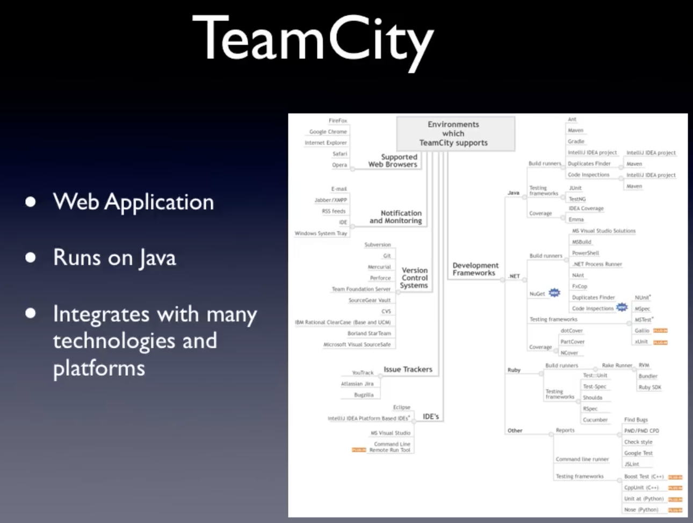
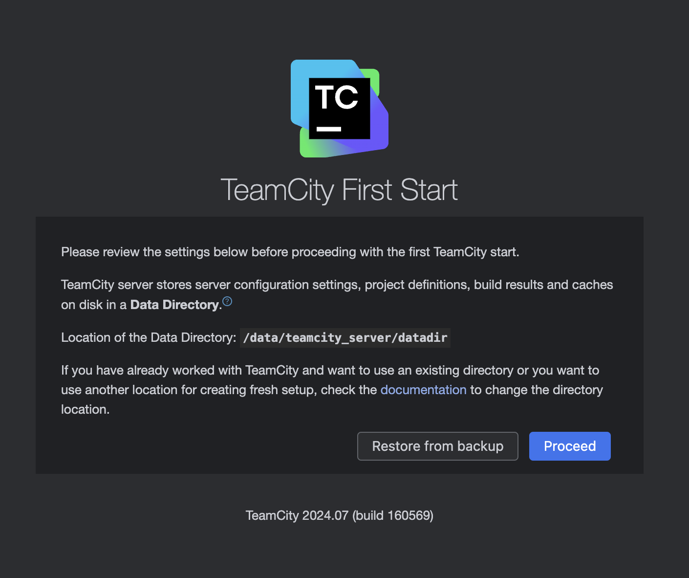
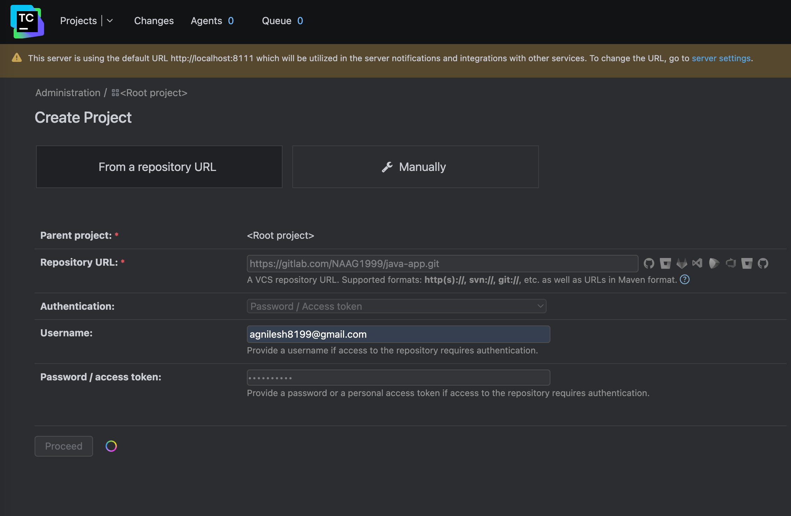
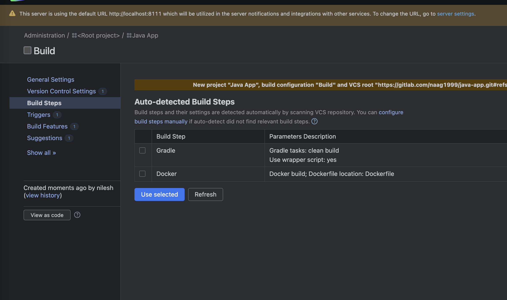
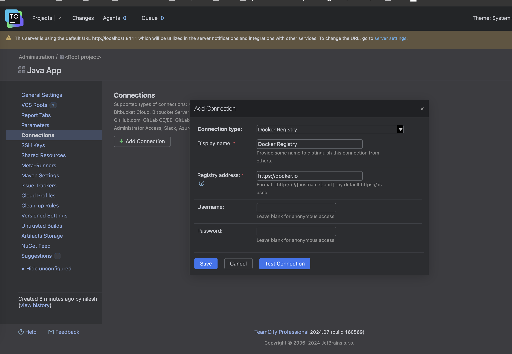

# What is TeamCity

TeamCity is a build management and continuous integration server from JetBrains.

TeamCity is a Continuous Integration and Deployment server that provides out-of-the-box continuous unit testing, code quality analysis, and early reporting on build problems. A simple installation process lets you deploy TeamCity and start improving your release management practices in a matter of minutes. TeamCity supports Java, .NET, and Ruby development and integrates perfectly with major IDEs, version control systems, and issue tracking systems.

TeamCity is used to build and test software products in an automated manner. It provides rapid feedback on every code change, reduces code integration problems, and leads to more effective teamwork. Many popular games, websites, banking systems, and all JetBrains products are built with TeamCity.

Features of teamcity: 

- Automate build and deployment process
- Increase quality and standards across teams
- Provide reporting and stas
- Support variety of tools and technologies





Traditional tools like Jenkins, need a lot of admin tasks.

TeamCity doesn't required any third part webhooks.

TeamCity managed model -> TeamCity cloud.

Pipeline configurations are written in kotlin, but a hybrid solution is also possible from the UI.


Build Chains: sequence of builds connected as dependencies

pass output from one build to another.

Personal Builds: developers own builds which is accessible to only the developers. 

- Useful when we want to test our changes before committing and integrating into existing code base

TeamCity server: 

- Build agents (can be EC2 instances, on-prem, docker container etc.)
- If the build creates docker images and pushes that to artifactory, we need the build agents to support docker.
- For npm builds, we need the build agents to support npm


###### How to setup teamcity-server?

https://hub.docker.com/r/jetbrains/teamcity-server/

Data directory --> where teamcity stores project settings and build results

```bash
:/data/teamcity_server/datadir \
```

- this is where the data directory will be mounted

Logs directory --> where teamcity stores project logs, with docker image it basically mounts where these logs will be stored


Run the following command: 

docker run \

-v team_city_data:/data/teamcity_server/datadir \ 

> -v team_city_logs:/opt/teamcity/logs \

> -p 8111:8111 \

-d jetbrains/teamcity-server


Team city will be available on local-host

http://localhost:8111/mnt



For the purpose of this lab, select the default internal database that is provided as part of teamcity free version.

Create the admin user account when prompted.

For the code, refer this basic Java app which has gradle build file in it. 

https://gitlab.com/NAAG1999/java-app.git



Create a project and configuration should look something like above. 

TeamCity will automatically detect which build tools are already available in the project. 



Once you have defined the build steps (these can be configured manually as well)

Connections to external applications can be set by adding new connections as below:



How to setup and install Build Agent in TeamCity?

Following methods are available:

[1] Install on OS

[2] Run as a Docker container

[3] TeamCity cloud, build agents are configured and managed by teamcity server.

Now let's say we want to start TeamCity agent with docker volume mount

docker run -e SERVER_URL="http://localhost:8111"  \

-v team_city_agent_config_two:/data/teamcity_agent/conf  \

-v /var/run/docker.sock:/var/run/docker.sock \

-v /usr/local/bin/docker:/usr/bin/docker \

-d jetbrains/teamcity-agent


All the configuration that we do in UI can be seen as code. 

Click the DSL on the server, and the configuration will be written in kotlin.
